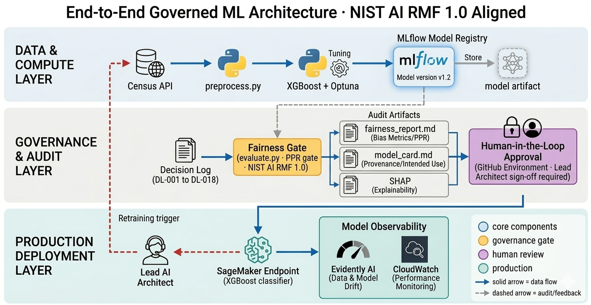

# From Model Accuracy to System Accountability: Designing Governed AI Systems

**Raghunath Devayajanam · April 2026**

---

Most AI systems don't fail because the model is wrong. They fail because governance was never engineered into the system.

In high-stakes environments, a model that is 99% accurate but 0% auditable isn't an asset. It's a liability.

---

## The Problem

We've optimized AI for speed of deployment.

Ingest data → train a model → drop it in a container → expose an endpoint → call it done.

But in enterprise and federal settings, where decisions impact eligibility, credit, or livelihoods, velocity without accountability is dangerous.

Rule-based systems are auditable by design. The logic is explicit, deterministic, and readable.

ML systems are not.

A gradient-boosted classifier has no intent, no explanation, and no accountability built in. Governance has to be engineered into the surrounding system, because it cannot be read out of the model itself.

Most production ML systems still look like this:

- Black-box models with no audit trail
- Monitoring without enforcement
- No enforceable fairness controls
- Design decisions with no documented rationale

In regulated environments, "we'll catch it in monitoring" is not a risk management strategy.

What's needed instead is a system where governance is enforced by design, not added after deployment.

---

## The System

I designed a governed ML system for income-based risk scoring using U.S. Census Bureau microdata. The same type of data that underpins federal program eligibility decisions.

Model complexity was earned, not assumed. Logistic Regression to Ridge to XGBoost. Each transition justified by demonstrated improvement.

But the model isn't the point. The system is.

The design principle was deliberate constraint. Every governance control exists because the problem required it:

- Fairness enforced as a CI/CD gate using PPR, aligned to EEOC and federal disparate impact standards. Any violation fails the pipeline. No deployment. No override
- SHAP explanations generated at inference time. The evidentiary basis for human review, not a debugging tool. Explainability is not a feature. It is a design requirement
- Every architectural decision recorded in a versioned decision log
- Deployment requires explicit human approval via an environment-level control

**The constraint is mechanical, not cultural.**

Every control is enforced by the system itself. Not dependent on process, documentation, or intent.

This is not a single pipeline. It is a reusable governance pattern for any AI system operating under regulatory constraints.

---

## The Real-World Tradeoff

In eligibility or risk scoring systems:

- False negative. Deny a qualified individual
- False positive. Allow a non-qualified individual

The system is tuned to recover ~85% of qualifying individuals, accepting more false positives as the deliberate tradeoff. This is a policy decision, not just a model outcome.

---

## A Note on Model Complexity

The industry is racing toward agentic AI. The governance debt being accumulated in that race is significant and largely unacknowledged.

A well-governed classical ML system on structured data delivers deterministic outputs, interpretable by design, auditable at every inference, at sub-millisecond latency and cents per thousand predictions. This is not a legacy pattern. In most federal and enterprise contexts, it is the architecturally correct choice.

In classical ML, outputs are deterministic and reproducible. Explainability can be engineered reliably. In generative systems, non-deterministic outputs make that engineering significantly harder, and that problem is largely unsolved.

**Complexity that cannot be audited is not sophistication. It is risk transferred to the organization.**

---

## Closing Thought

The future of AI won't be defined by model performance benchmarks. It will be defined by the rigor of the controls that determine which models reach production, and the integrity of the evidence trail that proves those controls held.

Because behind every AI prediction is a decision that will affect a real person, and in regulated systems, that decision must be defensible.

---

*Curious how others are embedding governance into their AI systems, particularly in regulated or federal environments where auditability is non-negotiable.*

*Independent project built on U.S. Census Bureau public microdata. Views are my own.*

---

**Repository:** [responsible-mlops-risk-engine](https://github.com/ai-systems-architect/responsible-mlops-risk-engine)
