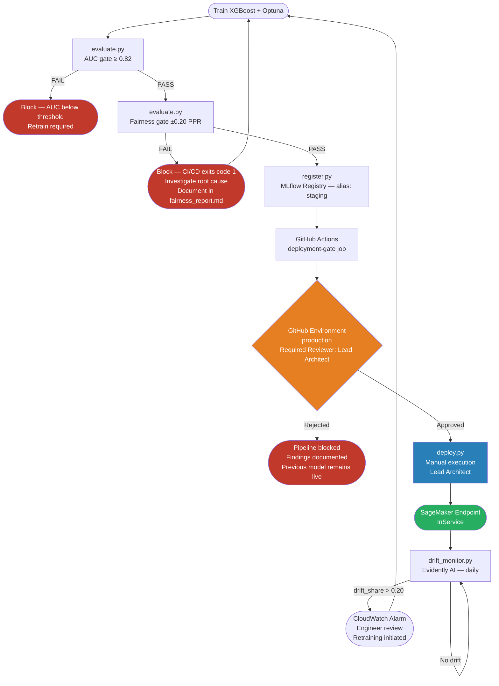

# System Architecture
## responsible-mlops-risk-engine

**Date:** 2026-03-19
**Author:** Raghunath Devayajanam

---

## Overview

End-to-end MLOps pipeline for income-based risk scoring on U.S. Census
Bureau data. Built to production standards — reproducible infrastructure,
automated fairness enforcement, drift monitoring, and a documented path
from development to national deployment.

The architecture is intentionally layered. Each layer has a single
responsibility and can be replaced independently. Swapping SageMaker for
Kubernetes or adding a new data source doesn't require touching the training
or fairness layers.

---

## Architectural Principles

Four principles govern every design decision in this pipeline:

**Separation of concerns** — Data, training, serving, and governance layers
are independent. Each can be replaced or extended without touching the others.
The serving layer has no dependency on sklearn transformers. The fairness
layer has no dependency on AWS.

**Fairness as a blocking control, not a reporting metric** — The fairness
gate in `evaluate.py` exits with code 1 on failure and blocks deployment.
A model that passes AUC thresholds but fails the fairness audit does not
proceed. This converts a policy commitment into a structural constraint.

**Reproducibility by construction** — Every parameter lives in `config.py`.
Every decision is recorded in `docs/decision_log.md`. Every model version
is tracked in MLflow with full artifact lineage. Reproducing any result
requires only the repo and the `.env` file.

**Human approval as a systemic requirement, not a process suggestion** —
No automated promotion path from staging to production exists. Human sign-off
is required before any model version reaches live traffic. This reflects the
standard in government delivery environments where automated gates are
necessary but not sufficient.

---

## System Diagram

```
┌─────────────────────────────────────────────────────────────────────┐
│                         DATA LAYER                                  │
│                                                                     │
│  Census API ──► ingest.py ──► data/raw/         (parquet)          │
│                     │                                               │
│                     ▼                                               │
│             preprocess.py ──► data/processed/   (parquet, joblib)  │
│                     │                                               │
│          ┌──────────┴──────────┐                                   │
│          │                     │                                   │
│    X_train/y_train        X_test/y_test + sensitive_*.parquet      │
└──────────┼─────────────────────┼───────────────────────────────────┘
           │                     │
┌──────────▼─────────────────────▼───────────────────────────────────┐
│                       TRAINING LAYER                                │
│                                                                     │
│  baseline.py  ──►  ridge.py  ──►  train_xgboost.py (Optuna)       │
│                                          │                          │
│                                    models/*.joblib                  │
│                                    models/*.json (native)           │
│                                          │                          │
│                                   evaluate.py                       │
│                                   (metrics + fairness gate)         │
│                                          │                          │
│                                   register.py                       │
│                                   (MLflow registry)                 │
└──────────────────────────────────────────────────────────────────── ┘
           │
┌──────────▼──────────────────────────────────────────────────────────┐
│                      SERVING LAYER                                   │
│                                                                      │
│  deploy.py ──► S3 (model.tar.gz) ──► SageMaker Endpoint            │
│                                      (XGBoost container)            │
│                                             │                        │
│                                      HTTPS invocations              │
│                    https://runtime.sagemaker.{region}.amazonaws.com │
│                    /endpoints/{endpoint-name}/invocations           │
└──────────────────────────────────────────────────────────────────── ┘
           │
┌──────────▼──────────────────────────────────────────────────────────┐
│                     MONITORING LAYER                                 │
│                                                                      │
│  drift_monitor.py ──► Evidently AI ──► CloudWatch metrics          │
│                              │                                       │
│                       drift_report_*.html                           │
│                              │                                       │
│                    CloudWatch Alarms (Terraform)                     │
│                    - endpoint-availability                           │
│                    - invocation-errors                               │
│                    - model-latency                                   │
│                    - DriftShare / DriftedFeatures                    │
└──────────────────────────────────────────────────────────────────── ┘
```

---

## Data Flow

### Ingestion
`src/data/ingest.py` pulls ACS PUMS 2023 microdata from the U.S. Census
Bureau API. The pull is parameterized by `STATE_CODE` in `config.py`:
- `"51"` — Virginia, 88,928 records, used for development
- `"*"` — all 50 states, ~1.5M records, documented future enhancement

Raw data is saved as timestamped parquet to `data/raw/`. The Census API
key is loaded from `.env` — never stored in source code.

### Preprocessing
`src/data/preprocess.py` handles all feature engineering in a single pass:

1. Drop invalid rows — negative income, age below 18
2. Create binary target — `wage_income >= 75000` → `high_income`
3. Separate sensitive features — race, sex, nativity physically removed
   from model data and saved separately
4. Encode categoricals — LabelEncoder fitted on training data
5. Scale numerics — StandardScaler fitted on training data
6. Stratified train/test split — 80/20, RANDOM_STATE=42

Encoders and scaler are saved to `data/processed/` alongside the split
data. These artifacts must be loaded together with the model at inference
time — applying different preprocessing to new data produces meaningless
predictions.

**person_weight handling:** The Census Bureau assigns each record a
population weight representing how many people that record represents.
It is excluded from model features and passed as `sample_weight` to
XGBoost, making the model representative of the full U.S. population
rather than the survey sample.

---

## Data Layer — Industry Practices

The following practices are standard in production ML pipelines ingesting
from unstable or multi-source data. Each was evaluated against this
pipeline's specific data source — the U.S. Census Bureau ACS PUMS API,
a government microdata release with a published schema and stable annual
cadence.

| Practice | Tool | Applied | Rationale |
|---|---|---|---|
| Schema validation | Great Expectations / Pandera | Not implemented | Census API schema is published and stable. Field changes are announced in annual documentation — caught by the runbook Section 10.2 response. Warrants implementation when ingesting from internal databases or third-party APIs with unstable contracts. |
| Data versioning | DVC | Not implemented | Raw parquet files are timestamped and gitignored. S3 versioning is enabled on the models bucket — the artifact that requires rollback. Raw data versioning adds overhead without recovery value for an annually-released government dataset. |
| Lineage tracking | MLflow / OpenLineage | Partially implemented | MLflow captures model lineage — hyperparameters, training data provenance, preprocessing artifacts, and fairness metrics. Dataset lineage (Census API → raw parquet → processed features) is documented in architecture.md but not formally tracked in a lineage system. Full OpenLineage integration is warranted when multiple pipelines share datasets. |
| Data quality assertions | Great Expectations | Not implemented | Evidently AI monitors distribution shifts post-deployment. The fairness gate catches demographic anomalies post-training. Upstream quality assertions add a layer of defense for pipelines where data quality is uncertain — not warranted for a government microdata source with a known, stable schema. |
| Feature store | Feast / Tecton | Not implemented | Single model, single feature set, batch ingestion cadence. Feature store overhead is justified when multiple models share features or real-time feature serving is required. Neither applies here. |

---

## Training

Three models were trained in sequence. Complexity is earned — each stage
required demonstrated metric improvement to justify the added complexity.

### Logistic Regression (baseline)
AUC 0.9108, F1 0.6508. Strong linear baseline. Coefficients reveal
`hours_per_week` as the dominant predictor (1.72), while `occupation`
carries near-zero linear signal (-0.005).

### Ridge Logistic Regression
AUC 0.9108, F1 0.6507. Cross-validation selected C=100 — the weakest
available regularization — confirming features are sufficiently independent
and L2 provides no benefit. Linear ceiling confirmed at AUC 0.91.

### XGBoost + Optuna
AUC 0.9506 (+0.0398), F1 0.7633 (+0.1125). 30 Optuna trials over 5-fold
cross-validation. The non-linear signal hypothesis from the baseline was
confirmed — `occupation` jumped from near-zero linear coefficient to 2nd
most important feature (0.17) in XGBoost. `class_of_worker` showed the
same pattern. These features carry interaction effects with education and
hours worked that logistic regression cannot capture.

Best parameters: n_estimators 403, max_depth 5, learning_rate 0.043,
scale_pos_weight 2.43 (handles class imbalance).

---

## Fairness Enforcement

Sensitive features — race, sex, nativity — are physically separated from
model inputs before training and used exclusively for post-prediction audit.
The model has no access to protected attributes.

`src/training/evaluate.py` computes positive prediction rate (PPR) and
AUC-ROC for each demographic group. PPR is the gate metric — it directly
operationalizes demographic parity, the standard used in EEOC and federal
disparate impact analysis, and requires no ground truth labels for
production monitoring. Per-group AUC validates that outcome rates are
earned through genuine discrimination, not by chance. Recall and F1 are
computed and reported as diagnostics but are not gate metrics — neither
measures cross-group outcome equity, and F1 is structurally tied to each
group's base rate regardless of model fairness. See DL-018.

Groups deviating more than ±0.20 PPR from the overall rate fail the
fairness gate and the pipeline exits with code 1, blocking deployment.

**Virginia audit result: PASSED** — 0/10 groups exceeded threshold.
Full findings in `docs/fairness_report.md`.

---

## Governance Flow

The complete path from model training to production — every gate, every
human touchpoint, and every failure path.



**Why human approval is structural, not procedural**

Automated gates — AUC threshold, fairness gate, CI/CD — are necessary
but not sufficient. The GitHub Environment gate converts the human
approval requirement from a documented process into a systemic
constraint: the deployment job cannot execute until a named reviewer
clicks approve in the GitHub Actions UI. This is not a reminder to get
sign-off — it is a hard stop that makes sign-off mechanically required.
See DL-015 for full rationale.

---

## Key Tradeoffs

The three decisions with the most significant architectural and ethical
consequences. Each is documented in `docs/decision_log.md` with full
alternatives considered.

| Tradeoff | Decision | What Was Traded |
|---|---|---|
| XGBoost vs. Logistic Regression | XGBoost selected — +4.4% AUC, +17.3% F1 | Per-feature interpretability reduced relative to logistic regression. Mitigated by XGBoost feature importance scores and SHAP — global beeswarm in evaluate.py, per-record waterfall in Streamlit demo. |
| Fairness threshold ±0.20 PPR | Set in `config.py`, enforced as a CI/CD hard stop | Looser than ideal for high-stakes automated decisions; tighter than unmonitored deployment. The ±0.20 threshold balances statistical reliability at small group sizes against regulatory caution. Tightening to ±0.15 would fail the American Indian group (n=68) on Virginia data — a sample size constraint, not a model failure. |
| Virginia vs. national training data | Virginia (88,928 records) for development and initial production | Faster iteration, proven end-to-end pipeline. Virginia is not demographically representative of national populations — particularly for small racial and ethnic groups. National expansion requires one config change (`STATE_CODE="*"`) and a full fairness audit rerun. |

---

## MLflow Experiment Tracking

`src/training/register.py` logs the full artifact bundle to MLflow:
- All hyperparameters
- Performance metrics and per-group fairness metrics
- Model artifact with input/output signature
- Preprocessing artifacts — encoders and scaler
- Fairness report attached to the run

Model registered as `income-risk-xgboost v2` with alias `staging`.
Production promotion requires explicit human approval — no automated
promotion path exists.

MLflow runs locally — `mlruns/` is gitignored. Start the UI with:
```bash
mlflow ui  # http://localhost:5000
```

---

## Infrastructure

All AWS resources are provisioned via Terraform — nothing created manually
through the console. `infrastructure/main.tf` provisions:

| Resource | Purpose |
|---|---|
| S3 raw data | Stores raw ACS PUMS parquet files from Census API pull |
| S3 processed | Stores engineered features, encoders, scaler artifacts |
| S3 models | Stores trained model artifacts for SageMaker deployment |
| IAM role | Least-privilege SageMaker execution role |
| IAM policy | Scoped to project buckets + default SageMaker bucket |
| CloudWatch alarms | Endpoint availability, error rate, p99 latency |

```bash
cd infrastructure
terraform init
terraform apply -var="aws_account_id=YOUR_ACCOUNT_ID"
```

Standing cost: ~$0.50/month (CloudWatch alarms + S3 storage). Full cost
model in the Cost Model section below.

---

## Security Architecture

### IAM Boundaries

Three IAM boundaries enforced through Terraform — no console-created roles
or wildcard permissions:

| Principal | Permissions | Scope |
|---|---|---|
| SageMaker execution role | Read model artifacts, write CloudWatch metrics | S3 models bucket only — no access to raw or processed data |
| Developer (AWS CLI) | Full pipeline operations | Credentials in `.env`, never in source code. Account ID scrubbed from git history. |
| CI/CD (GitHub Actions) | Lint and structure validation only | No AWS credentials in CI/CD — deployment is a manual step by design |

### Data Access Patterns

Three data boundaries enforced through separate S3 buckets (DL-017):

| Bucket | Content | Who Writes | Who Reads |
|---|---|---|---|
| S3 raw | ACS PUMS parquet — includes sensitive demographic fields | `ingest.py` | `preprocess.py` |
| S3 processed | Engineered features — sensitive fields removed before write | `preprocess.py` | Training pipeline |
| S3 models | Model artifacts only — no PII, no features | `deploy.py` | SageMaker execution role |

Sensitive features (race, sex, nativity) are separated at preprocessing
and are never written to the processed bucket, never passed to model
training, and never reach the serving layer.

### PII Handling

ACS PUMS microdata does not include direct identifiers — no names, SSNs,
or addresses. The dataset contains quasi-identifiers (age, occupation,
nativity) that could contribute to re-identification at very small group
sizes. The American Indian group (n=68 in the Virginia test set) is the
primary small-sample risk and is explicitly flagged in `docs/fairness_report.md`
for priority review after the national data pull.

Raw data files are gitignored and stored locally. In production they would
be written to the S3 raw bucket, where IAM bucket policies and access
logging restrict and record all access.

### Audit Logging

MLflow captures the complete lineage of every model version —
hyperparameters, training data provenance, metrics, preprocessing
artifacts, and fairness results. Every model version can be traced back
to the exact dataset and configuration that produced it.

CloudWatch logs all SageMaker endpoint invocations. Drift reports are
timestamped HTML artifacts that would be written to S3 for audit
retention in production. The decision log (`docs/decision_log.md`)
records every architectural decision with rationale, alternatives
considered, and date — DL-001 through DL-018.

---

## Cost Model

### Standing Costs (Infrastructure Only — No Active Endpoint)

| Resource | Monthly Cost | Notes |
|---|---|---|
| CloudWatch alarms (4) | ~$0.40 | $0.10/alarm/month |
| S3 storage (3 buckets) | ~$0.02 | < 1GB total across all buckets |
| MLflow | $0 | Runs locally on developer machine |
| **Total standing** | **~$0.50/month** | Zero compute cost when endpoint is down |

### On-Demand Costs (Active Endpoint)

| Resource | Cost | Notes |
|---|---|---|
| ml.m5.xlarge SageMaker endpoint | approx. $0.23/hr (approx. $5.50/day) | Destroyed immediately after verification in this portfolio |
| Optuna training (30 trials, local) | $0 | Runs on developer machine — ~25 minutes |
| Terraform apply/destroy | ~$0 | Compute is seconds, cost is negligible |

### Instance Type Rationale — ml.m5.xlarge

| Instance | vCPU | RAM | Cost/hr | Assessment |
|---|---|---|---|---|
| ml.t3.medium | 2 | 4GB | $0.056 | Insufficient — XGBoost container + model overhead approaches memory ceiling |
| ml.m5.large | 2 | 8GB | $0.115 | Viable for single-threaded inference; no headroom for concurrent requests |
| **ml.m5.xlarge** | **4** | **16GB** | **$0.230** | **Selected — standard production baseline, comfortable headroom for moderate concurrency** |
| ml.m5.2xlarge | 8 | 32GB | $0.461 | Over-provisioned for a single-model endpoint at this traffic volume |

ml.m5.xlarge is the standard starting point for SageMaker real-time
endpoints in production environments. It provides headroom for the
XGBoost container overhead, client-side preprocessing, and moderate
concurrent request volume without triggering auto-scaling prematurely.

### Cost at Scale

National deployment (STATE_CODE="*", ~1.5M records) does not change
endpoint costs — inference is stateless per request. Training cost
increases modestly: Optuna runs at national scale would move from local
execution to a SageMaker Training Job (ml.m5.4xlarge, ~$0.92/hr,
estimated 2–4 hour training run = ~$2–4 per retrain cycle).

An auto-scaling policy (future work) would scale the endpoint to zero
during off-peak hours, reducing the approx. $5.50/day standing cost to near
zero for low-traffic or batch-only deployments.

---

## Serving

`src/serving/deploy.py` packages the model in XGBoost native JSON format,
uploads to S3, and deploys to a SageMaker real-time endpoint.

**Why native JSON format:** The SageMaker XGBoost container natively loads
XGBoost's JSON format without requiring a custom inference script. Using a
custom script triggered the container's pip install mechanism, which failed
consistently regardless of script naming. Saving the booster directly with
`model.get_booster().save_model()` bypasses this entirely.

Endpoint URL:
```
https://runtime.sagemaker.{region}.amazonaws.com
/endpoints/{endpoint-name}/invocations
```

The endpoint costs approx. $5.50/day. In this portfolio it is deployed for
verification and destroyed immediately after screenshot. Production
deployment would use auto-scaling to bring instance count to zero during
off-peak hours.

Preprocessing is applied client-side before invocation. See DL-014 for
the full architectural rationale and alternatives considered.

---

## Monitoring

`src/monitoring/drift_monitor.py` runs Evidently AI drift analysis comparing
the training distribution (reference) against incoming production data (current).

Statistical tests are selected by Evidently AI based on feature type —
verified as appropriate for this feature set:

- Wasserstein distance — continuous features (age, hours_per_week).
  Measures magnitude of shift in the distribution.
- Jensen-Shannon distance — categorical features (marital_status).
  Measures % shift in distribution across categories. Score 0–1.
- Chi-squared — remaining categorical features.
  Compares expected vs actual counts per category.

9 metrics published to CloudWatch namespace `ResponsibleRiskEngine/Drift`
on every run. Alert threshold: drift_share > 0.20 triggers retraining
recommendation.

**Virginia baseline:** 0/6 features drifted. Drift share: 0.0.

**Drift Response Workflow:**
When drift_share exceeds 0.20, a CloudWatch alarm fires and notifies
the responsible engineer. The engineer reviews the drift report to
confirm the drift is meaningful before initiating retraining. Automated
retraining without human review is explicitly not implemented — see
DL-015 for full rationale.

---

## Alternative Deployment Targets

The pipeline is platform-agnostic above the serving layer. MLflow, Evidently,
XGBoost, and the fairness audit are not AWS-specific. Replacing SageMaker
requires only a `deploy.py` rewrite — everything else stays unchanged.

### Kubernetes
```
Dockerfile
k8s/deployment.yaml   — pod spec, resource limits, health checks
k8s/service.yaml      — LoadBalancer exposing the inference endpoint
k8s/hpa.yaml          — HorizontalPodAutoscaler for traffic-based scaling
```

The model artifact is pulled from S3 at container startup. The same
joblib-serialized XGBClassifier used locally works inside a standard
Python container.

### Azure Machine Learning
```python
from azure.ai.ml import MLClient
from azure.ai.ml.entities import Model, ManagedOnlineEndpoint

# Register model in Azure ML Registry
model = Model(path="models/xgboost_20260312.joblib", ...)
client.models.create_or_update(model)

# Deploy to managed online endpoint
endpoint = ManagedOnlineEndpoint(name="responsible-risk-engine")
client.online_endpoints.begin_create_or_update(endpoint)
```

### GCP Vertex AI
```python
from google.cloud import aiplatform

model = aiplatform.Model.upload(
    display_name="income-risk-xgboost",
    artifact_uri="gs://bucket/models/",
    serving_container_image_uri="us-docker.pkg.dev/vertex-ai/..."
)
endpoint = model.deploy(machine_type="n1-standard-4")
```

In all three cases: same training pipeline, same fairness audit, same
MLflow registry, same drift monitoring. Only the deployment target changes.

---

## Production Path

The pipeline is deployed and verified on Virginia (FIPS 51) data.
National expansion is a documented future enhancement:

1. **National data pull** — set `STATE_CODE = "*"` in `config.py`
2. **Retrain** — full pipeline from `ingest.py` through `register.py`
3. **National fairness audit** — Virginia results are not nationally representative
4. **Deployment approval** — human sign-off on national audit results
5. **Monitor** — drift_monitor.py against national training distribution

This is one config change followed by the same pipeline already
proven end-to-end on Virginia data.

---

## Tradeoffs and Future Work

### Pipeline Execution — Local Scripts
Ingestion and preprocessing currently run as local scripts. Raw and
processed data artifacts are stored locally and not written to S3 in
the current implementation. The three S3 buckets provisioned via
Terraform reflect the target production architecture:

- S3 raw — target destination for ingest.py output in production
- S3 processed — target destination for preprocess.py output in production
- S3 models — model artifact for SageMaker endpoint deployment (active)

Ingest and preprocessing are intentionally kept as standalone scripts —
consistent with the platform-agnostic design above the serving layer.
In production these scripts run as scheduled jobs on whatever orchestration
platform is available: a cron job on EC2, an Airflow DAG, a Kubernetes
CronJob, or a cloud-native scheduler. No script changes required —
only the execution environment and S3 write destination change.

**Future work:** Connect ingest.py and preprocess.py output to S3 raw
and processed buckets. Add orchestration trigger for scheduled and
drift-reactive retraining runs.

### Preprocessing and Serving — Intentional Separation
Preprocessing runs client-side and the SageMaker endpoint receives
preprocessed inputs. This is a deliberate architectural decision, not
a gap. Keeping preprocessing and serving as separate layers means:

- Preprocessing can be updated independently of the model
- The serving layer has no dependency on sklearn transformers
- The pattern is consistent with feature store architectures used
  in production — where features are prepared upstream and the
  model endpoint handles inference only

The known tradeoff is the inference contract — feature order, encoding,
and scaling must match the training artifacts exactly. This is documented
in DL-014 and the model card limitations section. The contract is managed
through versioned preprocessing artifacts saved alongside the model in
MLflow.

**Future work:** Formalize the inference contract with schema validation
at the preprocessing step — enforce feature order and type before
inputs reach the endpoint.

### National Scale
The pipeline is proven end-to-end on Virginia data (88,928 records).
National expansion (STATE_CODE="*", ~1.5M records) requires:
- Optuna trial budget review — 30 trials sufficient for Virginia,
  may need adjustment for national feature distributions
- SageMaker endpoint auto-scaling policy — current deployment is
  single instance, appropriate for development verification
- Evidently AI drift analysis memory and runtime review at 1.5M records
- CloudWatch alarm thresholds retuned for national traffic volume
- Full national fairness audit — Virginia results are not nationally
  representative, particularly for small demographic groups

**Future work:** National retrain is one config change. The infrastructure
and monitoring design are already built to support it.

### Retraining Automation
The current retraining trigger is manual — a CloudWatch alarm notifies
an engineer who initiates retraining after human review. EventBridge and
Lambda infrastructure for automated triggering is referenced in the
architecture but retrain_trigger.py is not implemented.

**Future work:** Implement retrain_trigger.py — EventBridge rule fires
on CloudWatch alarm, Lambda initiates the retraining pipeline, human
approval gate remains before production promotion.

### Auto-scaling
The SageMaker endpoint is deployed on a single ml.m5.xlarge instance.
For production traffic, an Application Auto Scaling policy would scale
instance count based on invocation rate and bring instances to zero
during off-peak hours to minimize cost.

**Future work:** Add auto-scaling policy to infrastructure/main.tf.

### Client Layer — Streamlit
Streamlit is used for portfolio demonstration. It is single-threaded
and not designed for production traffic. In a production deployment
the client layer would be a FastAPI service containerized and deployed
on Kubernetes or ECS, behind an API Gateway with authentication and
audit logging. The SageMaker endpoint and all pipeline components
remain unchanged — only the client layer changes.

**Future work:** Replace Streamlit demo with a FastAPI service for
production client-facing deployment.

### Model Drift — Not Monitored
Evidently AI monitors data drift — changes in input feature distributions
against the training baseline. Model drift — degradation in prediction
accuracy — is not monitored in the current pipeline.

Monitoring model drift requires ground truth labels post-deployment:
knowing whether each individual actually earned above $75,000 after
the model made its prediction. That data does not flow back automatically
in the current architecture.

CloudWatch alarms cover infrastructure health — endpoint availability,
error rate, and latency. These are proxies for model health but do not
measure prediction accuracy directly.

**Future work:** Implement delayed label collection — capture ground
truth outcomes after a defined period, recompute AUC and fairness
metrics against live predictions, and trigger retraining if model
performance degrades below MIN_AUC_THRESHOLD.

---

## Repository Structure

```
responsible-mlops-risk-engine/
├── config.py                          # All parameters — single source of truth
├── .env.example                       # Credential template
├── requirements.txt                   # Dependencies — sagemaker pinned to 2.x
├── PORTFOLIO.md                       # Portfolio overview
│
├── src/
│   ├── data/
│   │   ├── ingest.py                  # Census API pull
│   │   └── preprocess.py             # Feature engineering, split
│   ├── training/
│   │   ├── baseline.py               # Logistic Regression
│   │   ├── ridge.py                  # Ridge with L2
│   │   ├── train_xgboost.py          # XGBoost + Optuna
│   │   ├── evaluate.py               # Metrics + fairness gate
│   │   └── register.py               # MLflow registry
│   ├── serving/
│   │   └── deploy.py                 # SageMaker deployment
│   └── monitoring/
│       └── drift_monitor.py          # Evidently AI + CloudWatch
│
├── infrastructure/
│   ├── main.tf                        # S3, IAM, CloudWatch
│   ├── variables.tf
│   └── outputs.tf
│
└── docs/
    ├── decision_log.md               # DL-001 through DL-017
    ├── fairness_report.md            # Stakeholder fairness audit
    ├── nist_alignment.md             # NIST AI RMF 1.0 mapping
    ├── architecture.md               # This document
    ├── model_card.md                 # Model details, intended use, limitations
    └── runbook.md                    # Operational procedures
```

---

## Tech Stack

| Category | Technology |
|---|---|
| Language | Python 3.9 |
| ML | XGBoost 2.x, Scikit-learn, Optuna |
| Experiment tracking | MLflow 2.x |
| Fairness | Custom evaluate.py — PPR, AUC per demographic group |
| Drift monitoring | Evidently AI 0.7.x |
| Explainability | SHAP — global beeswarm (evaluate.py) + per-record waterfall (Streamlit demo) |
| Infrastructure | Terraform 1.x, AWS |
| Serving | SageMaker real-time endpoint |
| Storage | S3 (3 buckets — raw, processed, models) |
| Monitoring | CloudWatch, Evidently AI |
| CI/CD | GitHub Actions — flake8, structure validation |
| Demo | Streamlit |
